#  Jorge Bucio's Super Quiz 

> Super Quiz is an interactive, animated front-end quiz application configured to test your coding fundamentals. Built natively with HTML, CSS, Bootstrap, jQuery, and Anime.js, it features local storage mechanisms evaluating and cataloging real-time trivia data.

##  Preface 

I want to preface this by saying that, the RI team has been great this whole time. I have learned a lot from them,
and they have been instrumental in the making of this project with the things I have learned from them this past 19 weeks.

I want to thank all of TLM for the oportunity to be part of this experience. It has been challenging, but pleasant at the same time all the way through.

##  Project background 

By this point I had covered the basics of Javascript, things like `DOM manipulation`, `objects`, and `functions.` This project posed a challenge in a way that I was not expecting, I had to really ponder about how to tackle each item of the list, while making code that would be easy to understand, as well as be maintainable for the future, and contain all of the features I wanted to have.

###  For this project I employed all of the things I have learned thus far. 

- HTML mark up is always at the top of the list for me.
- CSS @key frames is used to animate the title at the intro of the page.
- Transitions are my go to for smooth looking animations with buttons.
- Animate is my favorite new toy since I discovered how to implement it to my work.
- I used session storage to take users scores and store them to campare scores with future scores.
- Local storage was used to store score data of the whole time spent playing.
- Local storage was also used to store questions added by users to save and use them in future playthroughs.

##  Technologies used: 

- HTML.
- CSS.
- Bootstrap.
- jQuery.
- Animate JS.

##  How to use the front end as a user: 

Introduction
  - At first, the user will encounter the <q> Super Quiz </q> name with an animation as a welcome of sorts with a button displaying <q> jump in </q> as a call to action. 
 

 First Stage   

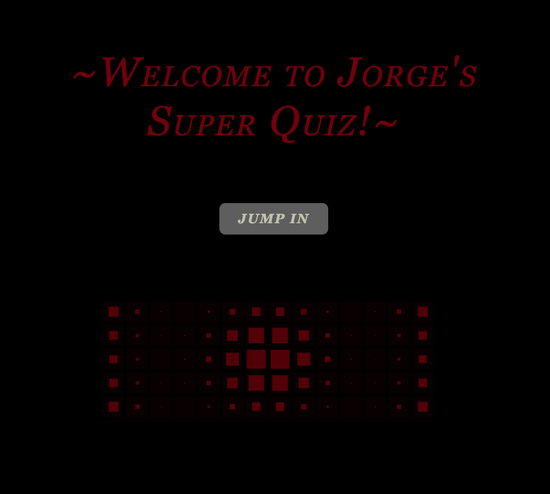

- Clicking the `jump in` button will take users to next stage of the game.

 

 Second Stage  

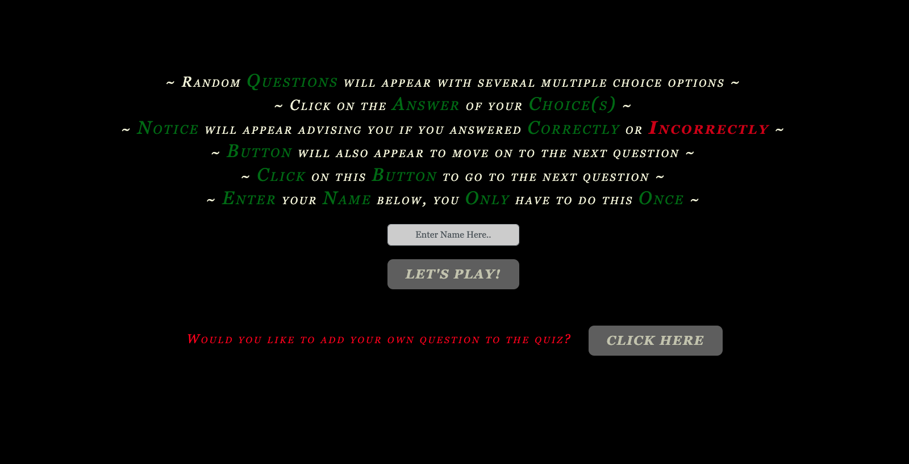

- This stage of the game displays `instructions`, an `input` field for the user to write their `name` to make the game more personable. It also contains a `button` for the user to add their own `question` to the game.

 

 Add Question  

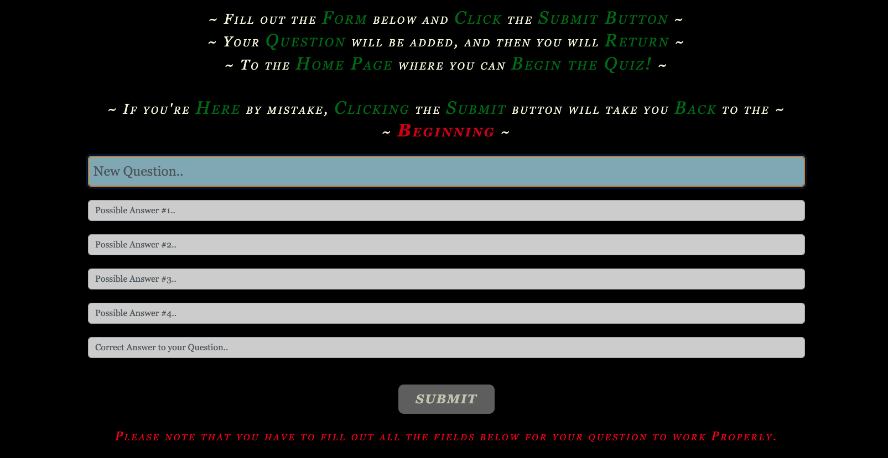

 - This section displays `intructions` on how to add a `question` for the user, with all the `required` fields for the app to work the way it was intended to. Then the user will be taken back to the previous stage where they can `begin` the `game`, either with or without inputing their name.

 

 Game Play   

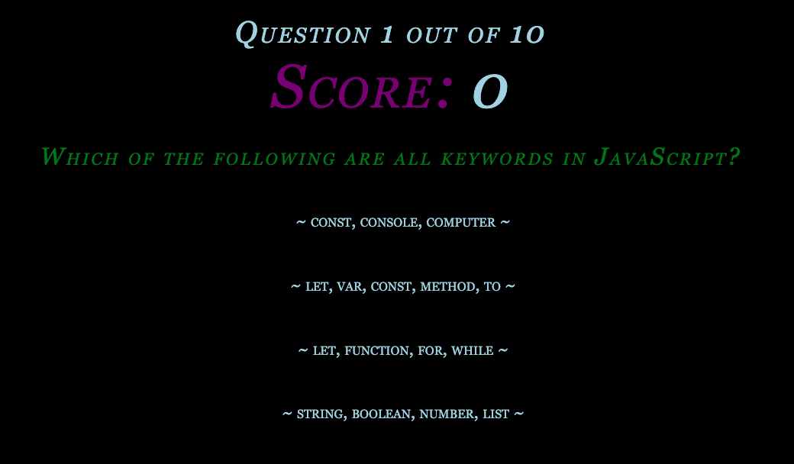

- User will be presented with a `scoreboard`, a `question counter` that keeps track of what question their on, and how far they have to go to finish. A `question` and for posible `answers` to select from.

 

 User Selection   

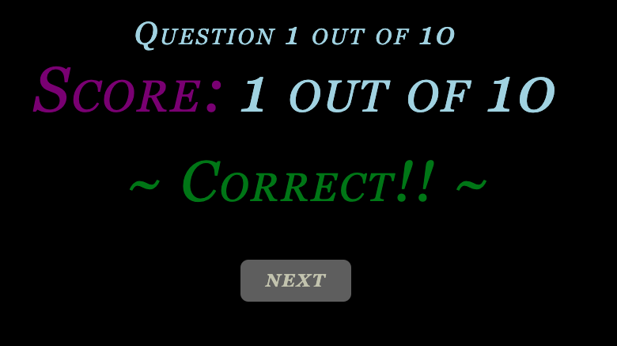

- If user answers `correctly`, a banner with `CORRECT!!` will display on screen, the `score` will be incremented, and a `next` button will appear for them to click and move on to the next question.

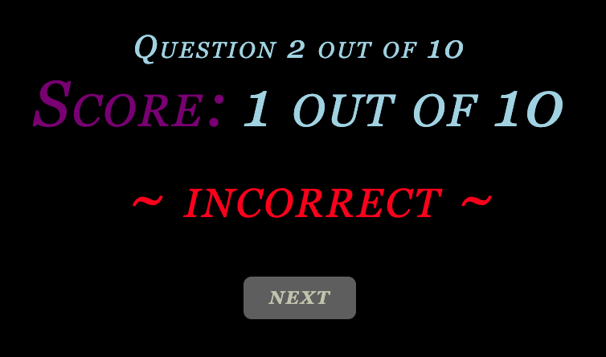

- If the user answers `incorrectly`, the same thing that happened with the correct answers will happen, but a message of `INCORRECT` will be displayed instead, and the score will not be incremented.

 

 At the End  

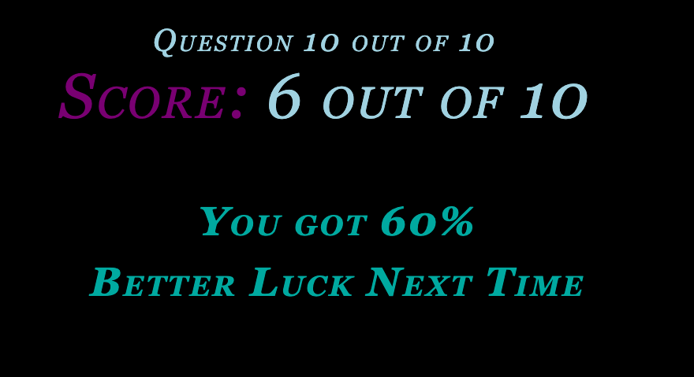

- User will be presented with a `percentage` total of what their `score` was. Along with some `words` of `encouragement`.

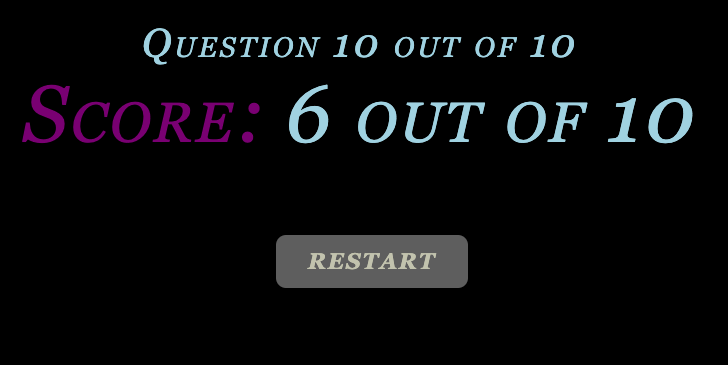

- Then the User will have access to a `restart` button to go back to the instructions part of the `Application`.

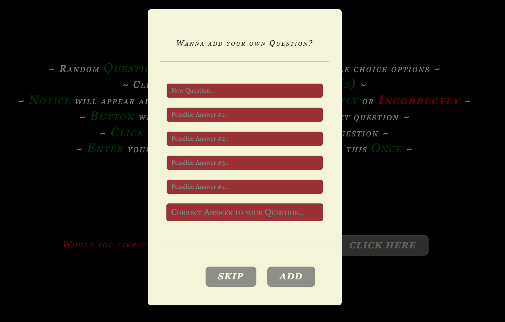

- A `restart` will pop up asking user if they would like to add their own `question`, but user can simply skip close this modal by `clicking` the `skip` button. The `modal` will close and the second stage of the `Application` will be revealed to them once again.

 

 If User typed their name in the Input field  

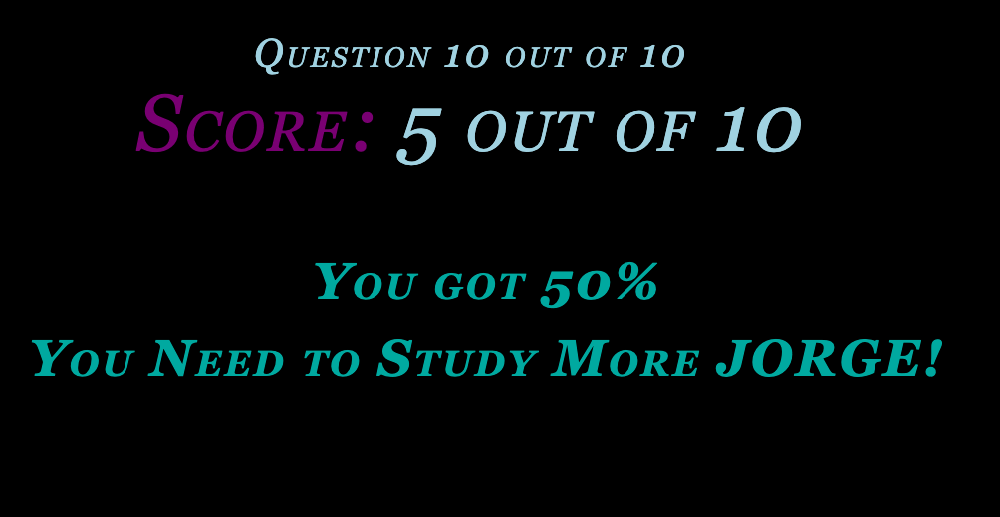

- User will be presented with a `percentage` total of what their `score` was. Along with some `words` of `encouragement` with their `name` displayed on screen.

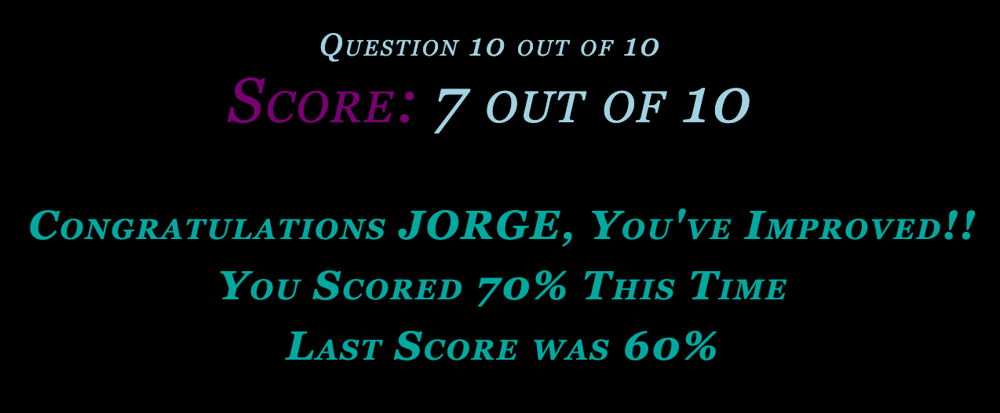

- User will be presented with a `percentage` total of what their `score` was. Along with some `words` of `encouragement` and telling them if they improved, `furthering` encouragement.

##  Project styles 

For this project I broke the convention of using four colors. Reason being that they all compliment eachother and add a modern feel. Green evokes success and a feeling of moving forward since its used for stoplights in most places. Red was used to visually let user know they chose the wrong answer. I used variables for colors streamline the process of changing color in the future.

###  Colors used for this project. 

- Black: #000
- Beige: #f4f4db
- Green: #008000
- Purple: #800080
- Lightseagreen: #20b2aa
- Lightblue: #add8e6
- Red: #ff0000
- Darkred: #8b0000
- Orange: #ffa500
- Grey: #808080
- Darkgrey: #a9a9a9
- Charcoal: #333

###  Fonts used for this project. 

- Fantasy.
- Georgia.
